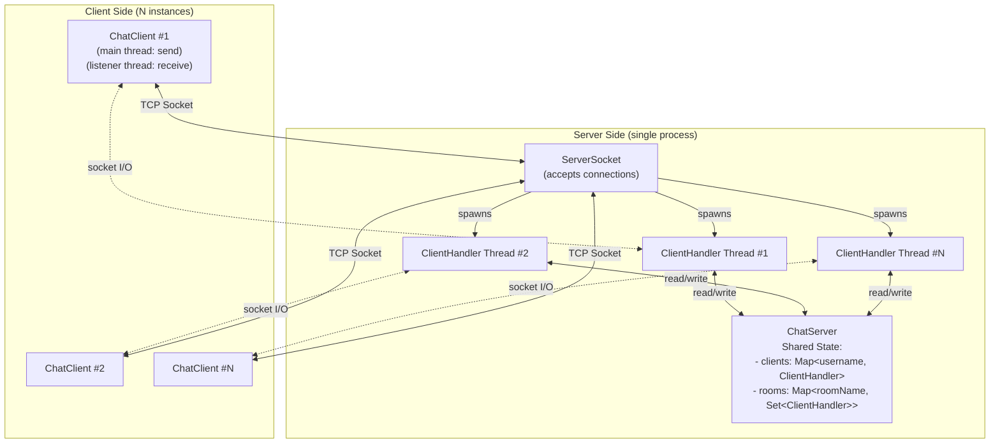
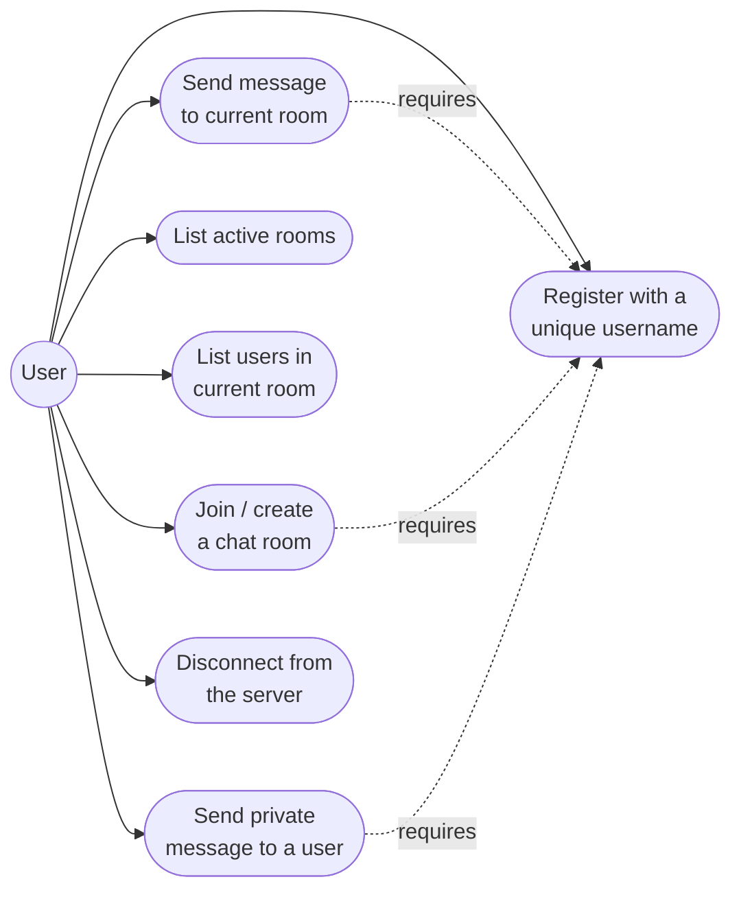
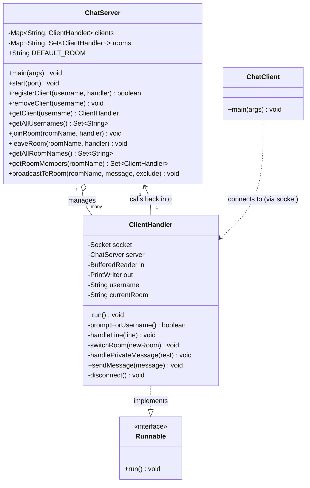
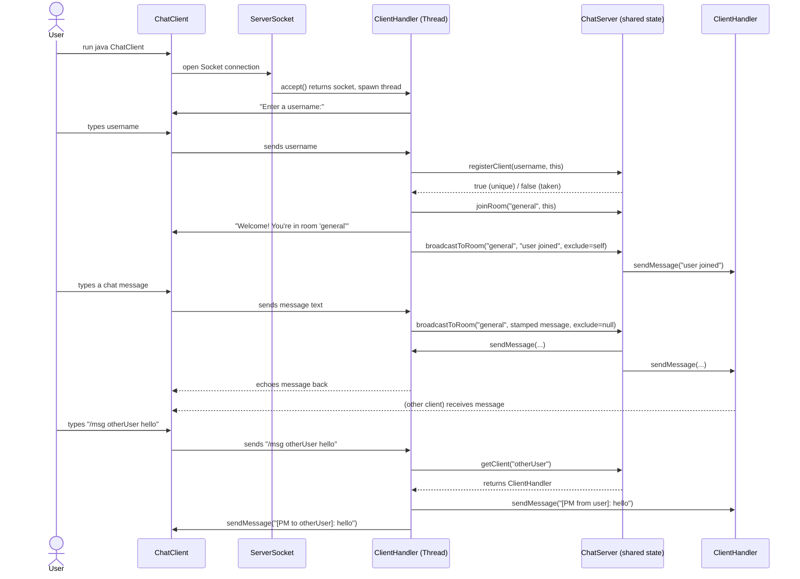
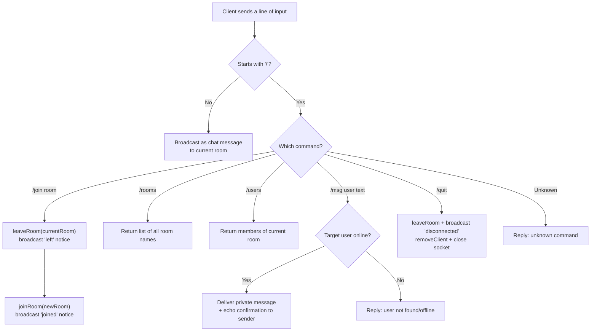

# System Diagrams — Java Chat Application

These diagrams are written in [Mermaid](https://mermaid.js.org/), which GitHub renders
automatically when viewing `.md` files in a repository — no extra tools needed.

---

## 1. System Architecture Diagram

Shows the overall structure: one server process handling many concurrent client
connections, each on its own thread, sharing state through the room/user registries.

**Key points:**
- The server follows a **thread-per-client** model: `ChatServer` only accepts connections; each `ClientHandler` runs independently.
- `ChatServer`'s maps are the single source of shared truth, so they use thread-safe collections (`ConcurrentHashMap`, `CopyOnWriteArraySet`).
- Each client runs two threads: one to send (keyboard input) and one to receive (server output), so sending and receiving never block each other.

---

## 2. Use Case Diagram

**Actor:** A single actor type, **User**, since every connected client has identical
capabilities (no admin/moderator role in the current scope).

---

## 3. Class Diagram

**Notes:**
- `ClientHandler` implements `Runnable` so each client can run on its own `Thread`.
- `ChatServer` owns the shared registries; `ClientHandler` never stores room/user state itself — it always asks `ChatServer`, which keeps a single source of truth.

---

## 4. Sequence Diagram — Connect, Join Room, Send Message, Private Message

---

## 5. Room-Switch / Disconnect Flow (Process Flow Diagram)

